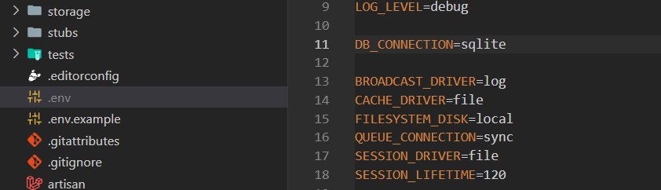

# 💥 Quiz


## 📜 Summary
This is a quiz game where it was used livewire and a little bit of alpine to study about this techs. In this quiz there's time to answer the questions and a ranking to show the positions of competitors where it's necessary to be logged to participate

## 📲 Demo


## ⚙️ Deploy

After you clone the project and access the folder, you need to create the .env file and setup, for example:



It's also necessary to run these commands:
```bash 
composer install 
php artisan key:generate
php artisan migrate
npm install
```
And to run the project:

```bash 
php artisan serve
npm run dev
```

And that's all folks!

